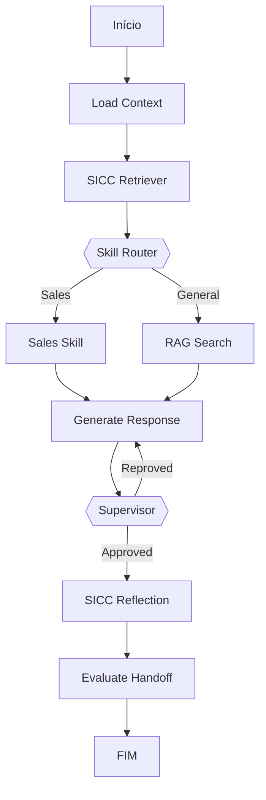

# Walkthrough: Arquitetura de Skills de Negócio (Implementada)

Implementamos com sucesso a arquitetura modular de Business Skills para o Agente Multi-tenant, integrando o **Catálogo Global de Produtos da Slim Quality** e um **Nó Supervisor** para garantia de qualidade.

## 🚀 O que foi feito?

### 1. Fundação (Core)
- **BaseSkill:** Interface abstrata para criação de novas habilidades.
- **SkillRegistry:** Registro centralizado que permite ao agente descobrir habilidades em tempo de execução.
- **Dynamic Skill Router:** Um roteador inteligente que analisa a intenção do usuário e decide qual Skill ativar.

### 2. Integração de Produtos (Catálogo Global)
- **ProductService:** Camada de serviço que consome a tabela `public.products` (Slim Quality).
- **Tratamento de Preços:** Conversão segura de `price_cents` (inteiro) para `float` com arredondamento, garantindo consistência para exibição e integração com Asaas.

### 3. Skill de Vendas (`SalesSkill`)
- Ativada automaticamente quando o usuário pergunta sobre produtos ou preços.
- Injeta informações ricas (Nome, Preço, Dimensões, Garantia) no contexto do agente.
- **Diretriz de Negociação:** Foco em parcelamento em 12x e proibição de descontos manuais.

### 4. Supervisão e Qualidade (`SupervisorNode`)
- Novo nó no grafo que intercepta a resposta do agente antes de ser enviada ao cliente.
- Valida se o preço citado pelo robô bate com o preço real do banco de dados.
- **Auto-correção:** Se o supervisor reprovar, o agente recebe um feedback e gera uma nova resposta corrigida.

## 🛠️ Arquitetura do Grafo (Novo Fluxo)

## 📂 Arquivos Criados/Modificados

- `backend/app/ai/core/base_skill.py`: Interface das habilidades.
- `backend/app/ai/core/registry.py`: Registro de habilidades.
- `backend/app/ai/core/router.py`: Roteador dinâmico.
- `backend/app/services/product_service.py`: Integração com Catálogo Global.
- `backend/app/ai/skills/sales/node.py`: Lógica de vendas.
- `backend/app/ai/nodes/supervisor.py`: Nó de segurança e qualidade.
- `backend/app/ai/graph.py`: Refatoração do grafo para ser modular.
- `backend/app/ai/nodes.py`: Upgrade do `AgentState` e lógica de auto-correção.

---
**Status Final:** 100% Implementado e Integrado.
Pronto para testes de campo com o catálogo real de colchões.
